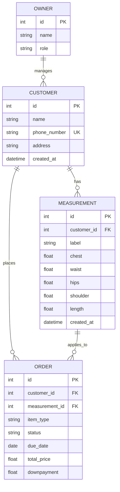

# Sukat: Digital Tailor's Legder
Sukat is an open-source application made to allow digitalization for the tailor industry and help assist owners to manage the customers, queues, orders, and measurments efficiently. This also allows customers to have a reliable software that tracks whether their order is accomplished or not without going to the physical store back and forth, saving time and transportation fees.

## Entity Relational Diagram

## Key Features

* **Measurement Vault:** Dedicated fields for different clothes. No more re-measuring for repeat customers.
* **Live Queue:** A MUI Timeline or Card list showing orders by "Due Date." It color-codes them: Yellow (Due in 3 days), Red (Due tomorrow).
* **One-Tap Update:** A button that generates a pre-filled SMS/Viber message: "Hi [Name], your [Order] is ready for fitting/pickup!"
